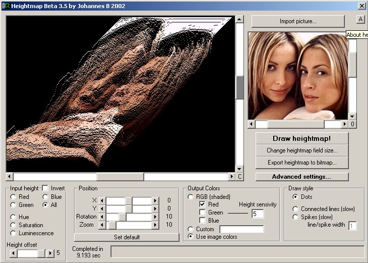



## Make 3D heightmap with 2D image as source\!

### Description

This code takes a 2D image (jpeg,bmp,gif,tga,pcx and many more) and converts it to a 3D heightmap. This is a realy cool 3D effect. Also please try the spike rendering mode that has a very smooth look. You can also use shaded colors to get a very cool effect on the drawed map!

Sample source images are included in zip file and the .bmp pictures looks realy cool with spike rendering mode! I also wanna thank the authors of the tga and pcx code! Please vote!
 
### More Info
 

             |
---                |---
**Submitted On**   |2002-07-24 00:29:44
**By**             |[Johannes B](https://github.com/Planet-Source-Code/PSCIndex/blob/master/ByAuthor/johannes-b.md)
**Level**          |Intermediate
**User Rating**    |4.9 (64 globes from 13 users)
**Compatibility**  |VB 5\.0, VB 6\.0
**Category**       |[Graphics](https://github.com/Planet-Source-Code/PSCIndex/blob/master/ByCategory/graphics__1-46.md)
**World**          |[Visual Basic](https://github.com/Planet-Source-Code/PSCIndex/blob/master/ByWorld/visual-basic.md)
**Archive File**   |[Make\_3D\_he1097457232002\.zip](https://github.com/Planet-Source-Code/johannes-b-make-3d-heightmap-with-2d-image-as-source__1-37204/archive/master.zip)

